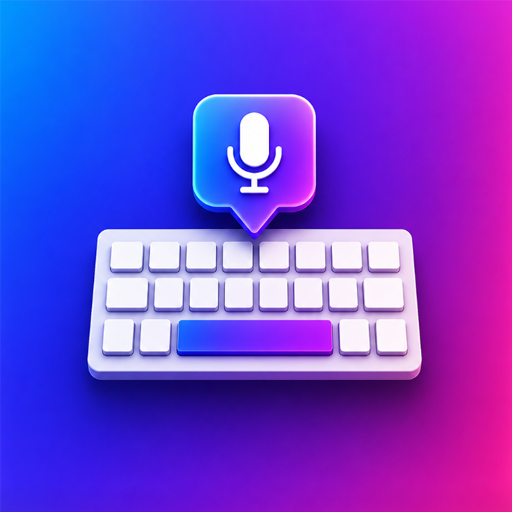

<p align="center">
  
</p>

<h1 align="center">Keyo</h1>

<p align="center">An AI-powered Android keyboard with voice dictation, an on-device assistant, and live spellcheck.</p>

---

## Overview

Keyo is a custom Android keyboard (`InputMethodService`) built entirely with Jetpack Compose.
Alongside a normal multi-language keyboard it adds:

- 🎤 **Voice dictation** — long-press the space bar, speak, and your speech is transcribed
  (Groq Whisper) and optionally cleaned up by an LLM.
- 🤖 **AI assistant** — hold the 🤖 key and say a task; the model can call tools on your phone
  (call a contact, send an SMS, set an alarm/timer, open an app, toggle the flashlight, change
  volume/brightness, search the web, read the clipboard, translate, write text, and more).
  Consequential actions (calling, texting) ask for an on-keyboard **Confirm / Cancel** first.
- 📝 **Live spellcheck & auto-correction** — typos are fixed as you type and voice input is
  tidied automatically.
- ⌨️ **Word suggestions** — an offline dictionary (EN/RU/LV) powers a dynamic suggestion strip:
  completions and next-word predictions while you type, the toolbar menu when you're idle. It
  learns your own words and phrases over time. Optional auto-correct on space.

## Features

- **3 languages** — English, Russian, Latvian. Enable the ones you want in Settings; switch
  with the 🌐 globe key (right of the comma) or by swiping the space bar. Latvian diacritics
  (ā č ē ģ ī ķ ļ ņ š ū ž) are available via long-press.
- **9 color themes** (Catppuccin, Dracula, Nord, Gruvbox, Solarized, Rosé Pine, Tokyo Night,
  AMOLED, Light).
- **Adjustable keyboard height** (Compact / Normal / Large / Extra-large). *Normal* is
  calibrated to match the stock keyboard's key size.
- **Configurable haptics** (Off / Light / Medium / Strong) and optional key-press sound.
- **Number row**, an **emoji row** in the symbols layout, and long-press alternates on letters.
- **Quick settings** — long-press the period and pick ⚙ to open Keyo settings from anywhere.
- Pick the transcription and assistant **models** independently.

## Tech stack

- Kotlin 2.2 · Jetpack Compose (Material 3)
- `InputMethodService` keyboard rendered through a `ComposeView`
- Groq API (Whisper transcription + chat/tool-calling) via OkHttp
- `minSdk` 26 · `targetSdk` 34 · `compileSdk` 36 · JDK 17
- Built with AGP 8.11 · Gradle 8.14 · JUnit unit tests · GitHub Actions CI

## Getting started

### Prerequisites

- Android Studio (or the Android SDK + JDK 17)
- A free **Groq API key** — create one at <https://console.groq.com/keys>

### 1. Clone

```bash
git clone https://github.com/crcknaka/Keyo.git
cd Keyo
```

### 2. Provide your Groq API key

The key is **not** committed. Supply it in either of these ways:

- **Build-time (recommended for development):** add it to `local.properties` in the project
  root (this file is git-ignored):

  ```properties
  GROQ_API_KEY=gsk_your_key_here
  ```

  Alternatively set a `GROQ_API_KEY` environment variable.

- **At runtime:** install the app and paste your key in **Settings → Groq API key → Save key**.
  A key entered here overrides the build-time default.

> `local.properties` also stores your Android SDK path (`sdk.dir`). Android Studio generates it
> automatically; if you build from the command line, add `sdk.dir=/path/to/Android/Sdk`.

### 3. Build & install

```bash
./gradlew assembleDebug
adb install -r app/build/outputs/apk/debug/app-debug.apk
```

(Windows: a convenience script `build-release.ps1` is included.)

### 4. Enable the keyboard

Open the **Keyo** app and follow the Setup steps:

1. **Enable keyboard** — System Settings → Languages & input
2. **Switch to Keyo** — input method picker
3. **Grant microphone** — required for voice input

## Usage

| Action | Gesture |
|---|---|
| Type | Tap keys (characters appear on key-down for low latency) |
| Accented / alternate characters | Long-press a letter, slide to the variant |
| Dictate | Long-press the space bar, speak, release |
| Run an AI task | Long-press the 🤖 key, speak a task, release |
| Switch language | Tap the 🌐 globe (right of the comma) or swipe the space bar |
| Numbers / symbols / emoji | Tap `123` |
| Open settings | Long-press the period, pick ⚙ |

## Project structure

```
app/src/main/java/com/keyo/
├── KeyoApp.kt              Application entry — loads the API key, registers tools
├── KeyoService.kt          The keyboard (InputMethodService + Compose UI)
├── SettingsActivity.kt     Settings screen (Compose)
├── KeyboardPrefs.kt        Preferences, themes, sizes, languages
├── GroqApi.kt              Transcription, spellcheck/cleanup, assistant + tool-calling
├── AudioRecorder.kt        16 kHz PCM → WAV recorder
└── tools/                  AI assistant tools (call, SMS, alarm, timer, app, …)
```

## Privacy

Keyo's AI features rely on the Groq cloud API, so some data leaves the device:

- **Voice dictation / AI assistant** — the recorded audio is sent to Groq for transcription
  and processing.
- **Live spellcheck & auto-correction** — when enabled, the text being edited is sent to Groq
  to be corrected.

What stays on device / what's protected:

- In **password fields and "no personalized learning" (incognito) fields**, Keyo disables
  spellcheck, voice and AI entirely — nothing is sent to the network there.
- **Clipboard history** is stored locally on the device only.
- Your **Groq API key** is stored locally (in `SharedPreferences` / `local.properties`) and is
  only sent to Groq as the request authorization.
- Disable **Live spellcheck** in Settings if you don't want edited text sent for correction;
  voice and AI only run when you explicitly hold the mic / 🤖 key.

## License

Released under the [MIT License](LICENSE).
